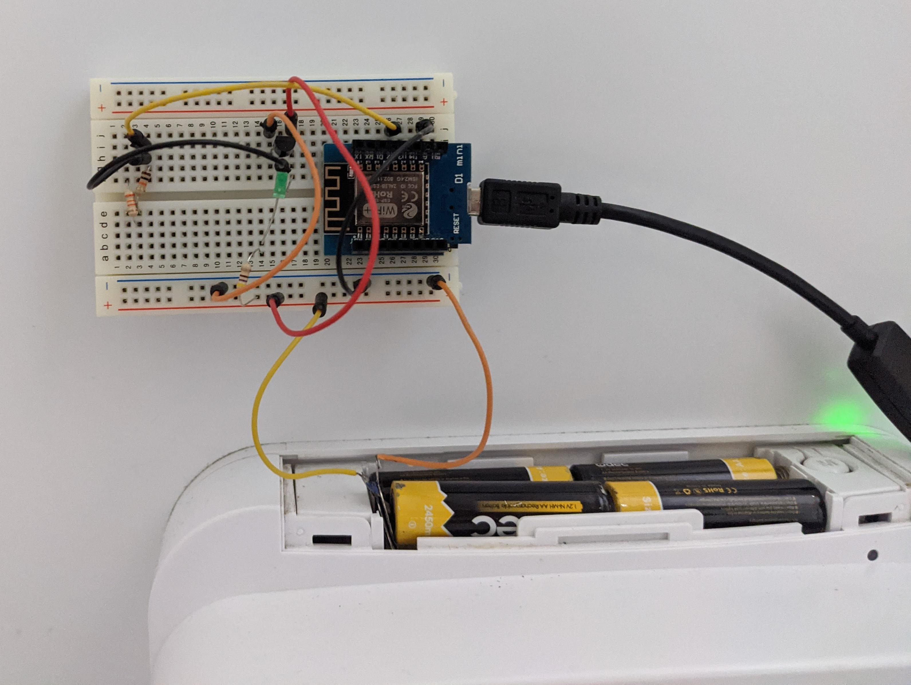

# Kiki's Gateway
Control your cat flap using your mobile over WIFI.
Get full control and "Lock", "Unlock" and "Open instantly" your cat flap.

## Motivation 
I have started this project as a curiosity to explore the ESP8266WiFi chip.
At the same time, I was having problems with my cat, Kiki. He would bring live mice in the house during the night.
So there was the need to control the cat flap without getting out the bed during the night. ;)

## Items used
 * MakerHawk D1 Mini NodeMcu 4M Bytes Lua WIFI Development Board Base on ESP8266 ESP-12F N Compatible NodeMcu Arduino ([Amazon](https://amzn.to/33cHNY3))
 * Cat Flap - [SureFlap Dual Scan Microchip](https://amzn.to/36gjk5L)
 * breadboar
 * wires
 * 1 NPN transistor
 
 

